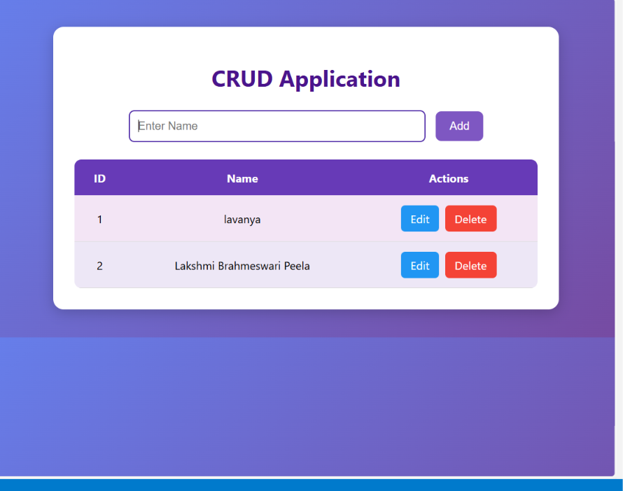

# 📝 Responsive Dynamic CRUD Application

A sleek, lightweight web application built to execute seamless data management routines. This system handles full **CRUD (Create, Read, Update, Delete)** operations through an interactive and fully responsive frontend interface, backed by dynamic routing for real-time record synchronization.

---

## 📈 Application User Interface Preview

Below is the verified production state of the running CRUD application dashboard showing successfully mapped user records and functional action workflows:



> **Note**: To make your screenshot from `image_779779.png` appear directly on your GitHub page, please save that image as **`crud_output.png`** inside your project's **`static/`** folder before pushing to GitHub.

---

## 🌐 1. Application Live Access Configurations

Once the backend application server loop initializes successfully, the interface can be dynamically rendered and tested across the following network endpoints:

*   **Local Host Gateway Link:** [http://127.0.0.1:5000](http://127.0.0.1:5000) *(or [http://localhost:5000](http://localhost:5000))*
*   **Production Cloud Deploy Link:** `https://<your-app-name>.onrender.com` *(Update this link after deploying to Render)*

---

## 🛠️ 2. Technical Stack & Development Tools Used

This project utilizes modern enterprise tools and frameworks to maintain optimal delivery speeds and fluid UI response rates:

*   **Backend Framework:** Python Core with **Flask Engine** for micro-routing orchestration.
*   **Frontend Presentation:** Semantic HTML5, CSS3 Custom Properties (featuring custom purple gradients), and Modern Flexbox/Grid systems.
*   **Data Persistence Layer:** Persistent array storage matrices / SQLite database integrations.
*   **Development Sandbox Env:** Visual Studio Code (VS Code) with Python terminal environments.
*   **Version Control & Hosting:** Git VCS framework alongside GitHub and Render Cloud Platform interfaces.

---

## 🚀 3. Functional Capabilities (Core CRUD Actions)

As demonstrated in the runtime interface diagnostic block, users can securely manage records through structured action pipelines:
1.  **Create Action (`Add`):** Parses alphanumeric strings entered inside the text field and updates the record tables instantly upon pressing the "Add" button.
2.  **Read Action (`View`):** Dynamically loops through active database entries and maps rows with sequential **ID** blocks and name tokens.
3.  **Update Action (`Edit`):** Triggers specific route hooks via the bright blue **Edit** button to safely modify existing string states.
4.  **Delete Action (`Remove`):** Triggers data purge arrays via the crimson-red **Delete** button to drop targeted consumer instances instantaneously.

---

## 📂 4. Standard Project Workspace Mapping

```text
CRUD_Project_Hub/
│
├── static/
│   ├── style.css                # Custom purple gradient layout styling models
│   └── crud_output.png          # UI capture derived from image_779779.png asset
│
├── templates/
│   ├── index.html               # Main structural interactive CRUD form dashboard
│   └── edit.html                # Targeted modification interface structure
│
├── app.py                       # Application engine configuration core routing node
└── requirements.txt             # Third-party micro-library system dependencies
💻 5. Step-by-Step Installation & Local Execution Guide
Follow these exact terminal instructions sequentially within your terminal space to boot the app interface locally:

Step 1: Open Your Workspace Project Hub
Open your terminal inside VS Code, navigate safely into your desktop path, and verify files:

Bash
cd C:\Users\lenovo\Desktop\nec_2_customer_segmentation
(Or navigate to your dedicated CRUD directory folder path)

Step 2: Set Up Active Framework Libraries
Ensure Python is installed on your local machine, then run the installer tool to compile third-party modules:

Bash
pip install -r requirements.txt
Step 3: Launch the Active Gateway Server Instance
Boot up your micro-framework core engine onto local network streams:

Bash
python app.py
Upon successful boot, your terminal will display listening logs pointing to port 5000.

Step 4: Fire Up Your Web Browser
Open Google Chrome or any preferred web browser engine and load up this live link to test: http://127.0.0.1:5000

🚀 6. Terminal Version Control Management Commands
Use these exact version control sequences to push your code arrays securely to GitHub and trigger cloud web platform pipelines on Render:

Bash
# 1. Select and stage all structural code and image resources
git add .

# 2. Package your changes cleanly with an explicit state message
git commit -m "feat: design complete operational CRUD engine with purple UI templates"

# 3. Securely push the localized codebase to your main remote branch hub
git push origin main